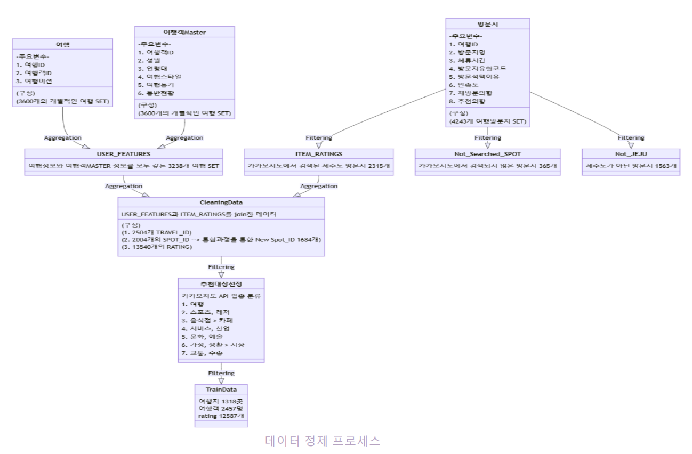

# 제주도 여행지 추천 웹서비스 개발

#### 프로젝트 내용 : 취향, 연령, 여행 주제 등의 개인적 특성에 기반한 제주도 여행지 추천 웹서비스 개발

## 데이터 정리

- 데이터 출처 : AI-Hub 국내여행로그데이터(제주도및도서지역)
- 데이터 분석 및 추천시스템 개발의 핵심 데이터 테이블 선정

  

- 데이터 정제 프로세스

  

## 데이터 분석
- 60여개의 변수 중 여행객의 관광지 방문 만족도를 설명하는 주요 변수 추출(Variable Importance)
- 여행객/관광지 핵심변수 기반 클러스터링 실시 -> 군집번호를 모델링에서 예측변수로 활용

  

## 추천시스템 개발
- Catboost 알고리즘을 활용해 맞춤형 추천시스템 개발

## API 개발
- 개발 프레임워크 : FastAPI

- 배포 : AWS

- 메소드 : POST

- Request Body : 유저특성(User Features)

- 요청결과 : 각 카테고리 별 관광지 5곳
